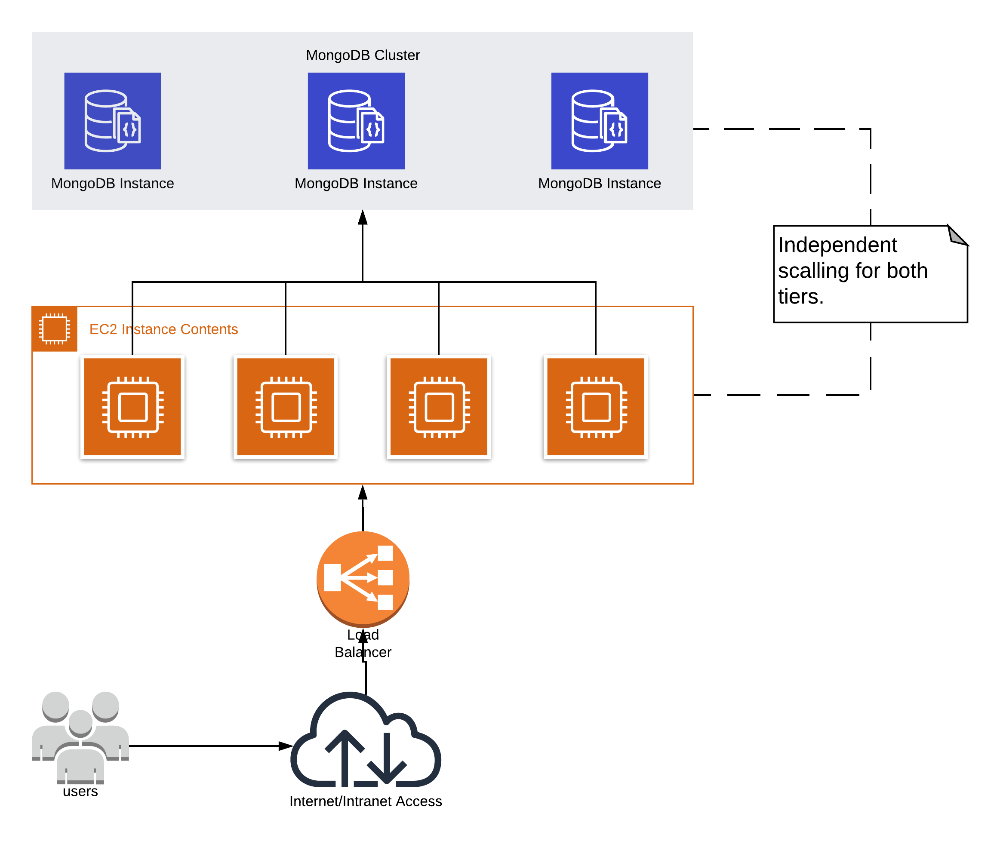

# Solution Architecture

In order to make this application scalable I decided to break it in two layers:
- Web Layer
- Data Layer

### Web Layer
In WebLayer we put the services that answer HTTP requests. This services are stateless applications that handle user
requests and store it into DataLayer. If the number of requests start to increase and the processing power from current
instances becomes a bottleneck we can add extra instances to share the workload. It can be achieved using a load balancing
strategy. The load balancing strategy will vary with the application host.

### Data Layer
As the requests need to store some state, I decided to use a Data Layer to store this data. The requests are based
on an ID that identify the flow of requests needed to execute the comparision. This way the application is session
independent and all the state can be stored in DataLayer. It promotes an simple and elastic solution.

# Suggested improvements

### Document the API
If the API is intended to be used by external developers it would be nice to create a documentation based on Swagger or
OpenAPI standards. With this approach we can make sure that all api users will know what to expect and how to call the
Api methods.
With Swagger it is also possible to automate the API client generation with some tools.

### Implement HATEOAS navigation
With some extra time we can apply the Hypermedia As The Engine Of Application State (HATEOAS) pattern ir order to make
the API self explanatory and allow clients to easy navigate our API.

### Use a better and already tested comparision API
There is some comparision APIs wide used and well tested that may be a improvement to current implementation. I think
that for tasks such text comparision we may leverage already existent solutions instead of creating our own.

### Check if comparision data can be transient
If comparision data may be ephemeral, if it does not need to be stored forever, we should check if the API call can
be simplified.
It will be good to send both data (left and right) within a single request and get the comparision result as a response.
This way we can remove the DataLayer and make the application scalable using only stateless instances of our app.

### Implement a ID generator
The way the application is implemented one user can overwrite the request from another user if he use the same ID for
the API calls. If a lot of users are doing parallel calls it can cause a mess with the results. It will be wise to
create another endpoint to generate an ID before the user start sending data or use the `stateless` approach from
previous suggestion, but saving only the comparision result and providing an ID to be used for later consultation.

### Security aspects
If this application is to be exposed on Internet we must take some security measures. A common approach is to have an API Gateway
exposed to the internet, in a DMZ network, that route the http requests to our application in a secure network. All the
authentication and attack prevention can be implemented by the API Gateway, so we can keep our app code simple.
If the application is intended to stay on intranet perimeter we can use a simple JWT token to keep track of our local
users and create some audit or access control process if needed.

### Add Logging and monitoring mechanism
I did not expend time creating a log mechanism. I did not implement any log at all. If this application was intended to
go to a production environment I will put some effort on logging to diagnose possible problems. I will also put some
health monitoring in order to know how the application is performing and help the decide if its time to scale up or down.

### Tune Spring Boot configuration
I let most of SpringBoot autoconfiguration features enabled. For a production deployment I would do a double check and
disable any unused features in order to make the application secure and lean.